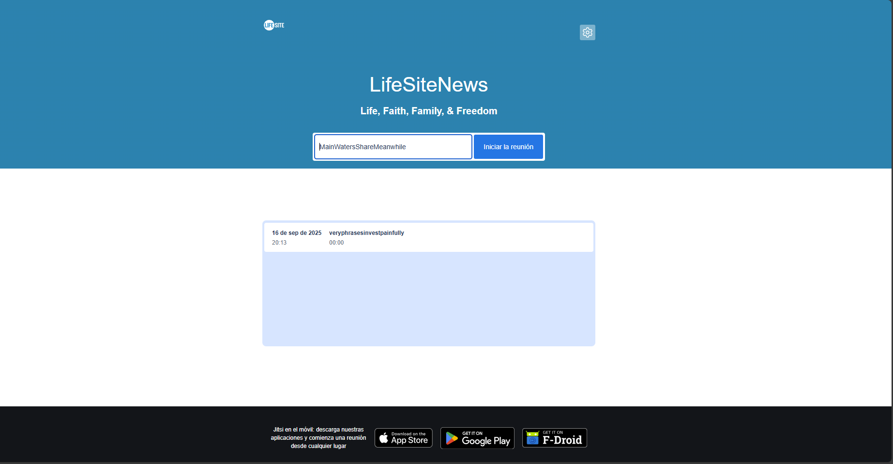
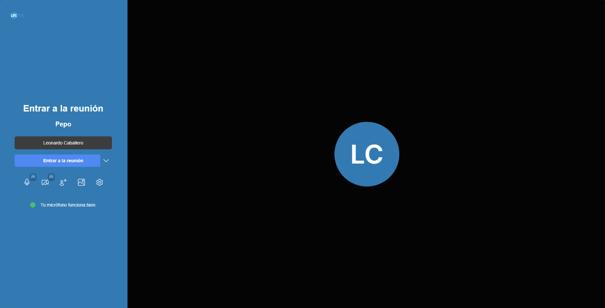

# LifeSite News Jitsi Custom Theme

This is a fork project from the [VitalPBX/VitalPBX-Meet](https://github.com/VitalPBX/VitalPBX-Meet) repository.

## Features

- Custom images

- Custom translations

- Custom CSS styles

- Custom HTML templtes

## Installation

For install custom theme with the *LifeSite News* Debraning, executing the following steps:

Step 1: Clone the Repository

```bash
cd ~/ && git clone hhttps://github.com/macagua/lifesitenews-jitsi-theme.git
cd ~/lifesitenews-jitsi-theme/
```

Step 2: Give execution permissions

You need to grant execution permissions to run the script, executing the following command:

```bash
sudo chmod +x ./install_jitsi_theme.sh
```

Step 3: Run script to install custom theme

You need run the install script, executing the following command:

```bash
sudo ./install_jitsi_theme.sh
```

Step 4: Restart Nginx service

You need restart Nginx service to apply the changes to after installation, executing the following command:

```bash
sudo systemctl status nginx && sudo systemctl restart nginx && sudo systemctl status nginx
```

In this way, `Jitsi Meet` will use the custom theme.

You can audit the Nginx error log file, executing the following command:

```bash
sudo tail -f /var/log/nginx/error.log
```

You can audit the Nginx access log file, executing the following command:

```bash
sudo tail -f /var/log/nginx/access.log
```

Congratulations! You have successfully installed Jitsi Meet custom theme on your `LSN` platform.

## Screenshots

### Landing page



### Chatroom login


